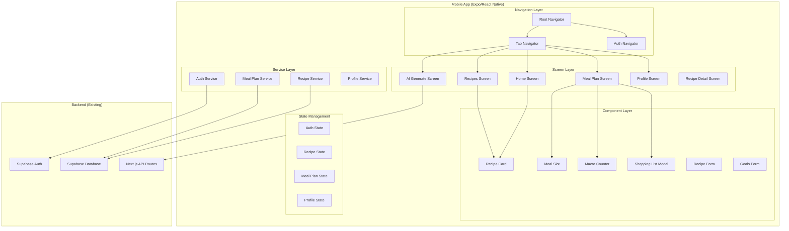

# Design Document: Mobile App Feature Parity

## Overview

This design document outlines the architecture, components, and implementation strategy for achieving feature parity between the ErmaJean web application and the React Native/Expo mobile application. The mobile app will be enhanced with a premium design system featuring smooth animations, haptic feedback, and a modern visual language while maintaining full functionality alignment with the web app.

The key additions include:
- Weekly meal planning with calendar interface
- Shopping list generation and management
- Enhanced recipe management with manual entry
- Macro tracking and goal management
- Premium UI/UX with animations and haptic feedback
- Recipe sharing via deep links

## Architecture



## Components and Interfaces

### Navigation Structure

```typescript
// Root Navigation
type RootStackParamList = {
  '(tabs)': undefined;
  '(auth)/sign-in': undefined;
  'recipe/[id]': { id: string };
  'modal': undefined;
};

// Tab Navigation
type TabParamList = {
  index: undefined;        // Home
  recipes: undefined;      // Recipe List
  generate: undefined;     // AI Generation
  'meal-plans': undefined; // Meal Planning (NEW)
  profile: undefined;      // Profile
};
```

### Core Components

#### 1. MealPlanScreen (NEW)
Primary screen for weekly meal planning with calendar view.

```typescript
interface MealPlanScreenProps {}

interface MealSlot {
  date: string;           // YYYY-MM-DD format
  mealType: 'Breakfast' | 'Lunch' | 'Dinner';
  recipeId?: string;
  recipeName?: string;
}

interface WeekState {
  startDate: Date;
  endDate: Date;
  meals: MealSlot[];
}
```

#### 2. MealSlotComponent (NEW)
Individual meal slot within the calendar.

```typescript
interface MealSlotProps {
  date: string;
  mealType: string;
  recipe?: Recipe;
  onPress: () => void;
  onDelete: () => void;
}
```

#### 3. MacroCounterComponent (NEW)
Displays daily macro totals against goals.

```typescript
interface MacroCounterProps {
  date: string;
  plannedMeals: MealSlot[];
  recipes: Recipe[];
  macroGoals?: MacroGoals;
}

interface MacroGoals {
  calories: number;
  protein: number;
  carbs: number;
  fat: number;
}
```

#### 4. ShoppingListModal (NEW)
Modal for viewing and managing shopping list.

```typescript
interface ShoppingListModalProps {
  visible: boolean;
  onClose: () => void;
  weekStart: Date;
  weekEnd: Date;
  plannedMeals: MealSlot[];
  recipes: Recipe[];
}

interface ShoppingItem {
  id: string;
  name: string;
  quantity: string;
  category: string;
  checked: boolean;
}
```

#### 5. RecipeFormModal (NEW)
Form for manual recipe entry.

```typescript
interface RecipeFormProps {
  visible: boolean;
  onClose: () => void;
  onSubmit: (recipe: RecipeInput) => Promise<void>;
}

interface RecipeInput {
  recipe_name: string;
  description: string;
  prep_time: string;
  cook_time: string;
  total_time: string;
  servings: string;
  difficulty_level: string;
  course: string;
  ingredients: string;
  instructions: string;
  calories?: number;
  protein?: number;
  carbs?: number;
  fat?: number;
  fiber?: number;
  sugar?: number;
  sodium?: number;
}
```

#### 6. GoalsFormModal (NEW)
Form for editing macro goals.

```typescript
interface GoalsFormProps {
  visible: boolean;
  onClose: () => void;
  currentGoals: MacroGoals;
  onSave: (goals: MacroGoals) => Promise<void>;
}
```

#### 7. AddRecipeFAB (NEW)
Floating action button with options menu.

```typescript
interface AddRecipeFABProps {
  onAIGenerate: () => void;
  onManualAdd: () => void;
  recipeCount: number;
  planType: 'free' | 'monthly' | 'unlimited';
  planLimit: number | null;
}
```

### Service Interfaces

#### MealPlanService (NEW)

```typescript
interface MealPlanService {
  getMealPlans(weekStart: Date, weekEnd: Date): Promise<MealSlot[]>;
  addMealToPlan(date: string, mealType: string, recipeId: string): Promise<void>;
  removeMealFromPlan(date: string, mealType: string): Promise<void>;
  clearWeekMealPlan(weekStart: Date, weekEnd: Date): Promise<void>;
}
```

#### RecipeService (Enhanced)

```typescript
interface RecipeService {
  getRecipes(): Promise<Recipe[]>;
  getRecipeById(id: string): Promise<Recipe>;
  createRecipe(recipe: RecipeInput): Promise<Recipe>;
  updateRecipe(id: string, recipe: Partial<RecipeInput>): Promise<Recipe>;
  deleteRecipe(id: string): Promise<void>;
  generateRecipe(params: GenerateParams): Promise<Recipe[]>;
  generateNutrition(recipeId: string): Promise<NutritionInfo>;
}
```

#### ProfileService (Enhanced)

```typescript
interface ProfileService {
  getProfile(): Promise<Profile>;
  updateProfile(profile: Partial<Profile>): Promise<Profile>;
  updateMacroGoals(goals: MacroGoals): Promise<void>;
}
```

## Data Models

### Existing Models (from types/config.ts)

```typescript
type Recipe = {
  id: string;
  recipe_name: string;
  total_time: string;
  description: string;
  prep_time: string;
  servings: string;
  cook_time: string;
  difficulty_level: string;
  course: string;
  ingredients: string;
  instructions: string;
  est_cost?: string;
  est_savings?: string;
  calories?: number;
  protein?: number;
  carbs?: number;
  fat?: number;
  fiber?: number;
  sugar?: number;
  sodium?: number;
};

interface Profile {
  id: string;
  name: string;
  email: string;
  location?: string;
  has_access: boolean;
  price_id?: string;
  calorie_goal?: number;
  protein_goal?: number;
  carb_goal?: number;
  fat_goal?: number;
}
```

### New Models

```typescript
interface MealPlan {
  id: string;
  user_id: string;
  date: string;
  meal_type: 'Breakfast' | 'Lunch' | 'Dinner';
  recipe_id: string;
  created_at: string;
}

interface DayMacros {
  date: string;
  calories: number;
  protein: number;
  carbs: number;
  fat: number;
  fiber: number;
  sugar: number;
  sodium: number;
}

interface ShoppingListItem {
  id: string;
  ingredient: string;
  quantity: string;
  unit: string;
  category: string;
  checked: boolean;
}
```

## Correctness Properties

*A property is a characteristic or behavior that should hold true across all valid executions of a system-essentially, a formal statement about what the system should do. Properties serve as the bridge between human-readable specifications and machine-verifiable correctness guarantees.*

Based on the prework analysis, the following properties have been identified after eliminating redundancy:

### Property 1: Recipe Search Filtering
*For any* search query and recipe list, the filtered results SHALL only contain recipes where the recipe name or description includes the search term (case-insensitive).
**Validates: Requirements 1.2**

### Property 2: Plan Limit Enforcement
*For any* user with recipe usage count >= plan limit, attempting to generate a recipe SHALL trigger the upgrade modal display.
**Validates: Requirements 2.4**

### Property 3: Weekly Calendar Structure
*For any* week displayed in the meal plan view, the calendar SHALL render exactly 7 days with exactly 3 meal slots (Breakfast, Lunch, Dinner) per day, totaling 21 slots.
**Validates: Requirements 3.1**

### Property 4: Meal Assignment Persistence
*For any* meal slot assignment (date, mealType, recipeId), after saving, querying the meal plan for that date and meal type SHALL return the assigned recipe.
**Validates: Requirements 3.3**

### Property 5: Week Navigation Date Range
*For any* week navigation action (previous/next), the loaded meal plans SHALL only contain entries where the date falls within the selected week's start and end dates.
**Validates: Requirements 3.5**

### Property 6: Daily Macro Calculation
*For any* day with planned meals, the displayed macro totals (calories, protein, carbs, fat) SHALL equal the sum of the corresponding values from all recipes assigned to that day's meal slots.
**Validates: Requirements 3.6**

### Property 7: Shopping List Ingredient Aggregation
*For any* week's meal plan, the generated shopping list SHALL contain all ingredients from all recipes in the plan, with duplicate ingredients combined and quantities summed.
**Validates: Requirements 4.1, 4.2**

### Property 8: Recipe Detail Field Rendering
*For any* recipe with complete data, the detail view SHALL display all required fields: name, description, prep_time, cook_time, total_time, servings, difficulty_level, course, ingredients (as list), instructions (as numbered steps), and nutrition info when available.
**Validates: Requirements 5.1, 5.2, 5.3, 5.4**

### Property 9: Profile Data Display
*For any* authenticated user, the profile screen SHALL display the user's name, email, subscription status (has_access), and macro goals (calorie_goal, protein_goal, carb_goal, fat_goal).
**Validates: Requirements 6.1**

### Property 10: Goal Update Persistence
*For any* macro goal update, after saving, the profile SHALL reflect the new goal values both in the database and in the UI.
**Validates: Requirements 6.3**

### Property 11: Premium Status Display
*For any* user with has_access=true, the profile SHALL display a "Premium" badge and upgrade prompts SHALL be hidden throughout the app.
**Validates: Requirements 6.5**

### Property 12: Recipe Form Validation
*For any* recipe submission missing required fields (name, description, ingredients, instructions), the form SHALL display validation errors and prevent submission.
**Validates: Requirements 7.4**

### Property 13: Manual Recipe Persistence
*For any* valid manual recipe submission, after saving, the recipe SHALL appear in the user's recipe list with all submitted field values intact.
**Validates: Requirements 7.3**

### Property 14: Auth State Navigation
*For any* app launch, if no active session exists, the app SHALL navigate to the sign-in screen; if an active session exists, the app SHALL navigate to the home screen.
**Validates: Requirements 9.1, 9.4**

### Property 15: Auth Error Display
*For any* authentication failure, the app SHALL display an error message that describes the specific issue (invalid credentials, network error, etc.).
**Validates: Requirements 9.5**

### Property 16: Share Link Format
*For any* recipe share action, the generated share URL SHALL follow the format `https://ermajean.com/recipe/{recipeId}` and contain the correct recipe ID.
**Validates: Requirements 10.2**

### Property 17: Deep Link Navigation
*For any* valid recipe deep link URL, opening the link SHALL navigate directly to the recipe detail screen for that specific recipe ID.
**Validates: Requirements 10.3**

## Error Handling

### Network Errors
- Display toast notification with retry option
- Cache last successful data for offline viewing
- Show offline indicator in header when disconnected

### Authentication Errors
- Invalid credentials: Display specific error message
- Session expired: Redirect to sign-in with message
- Network failure during auth: Show retry option

### API Errors
- Rate limiting: Display cooldown message with timer
- Server errors (5xx): Show generic error with retry
- Validation errors (4xx): Display field-specific messages

### Data Validation Errors
- Recipe form: Highlight invalid fields with error messages
- Goals form: Validate numeric ranges (e.g., calories 500-10000)
- Meal plan: Prevent duplicate assignments to same slot

## Testing Strategy

### Property-Based Testing Library
The mobile app will use **fast-check** for property-based testing in TypeScript/JavaScript. This library integrates well with Jest and provides excellent support for generating arbitrary test data.

### Test Configuration
- Each property-based test SHALL run a minimum of 100 iterations
- Each property-based test SHALL be tagged with a comment referencing the correctness property: `**Feature: mobile-app-feature-parity, Property {number}: {property_text}**`

### Unit Tests
Unit tests will cover:
- Individual component rendering with various props
- Service method behavior with mocked Supabase client
- Utility functions (date formatting, macro calculations)
- Form validation logic

### Property-Based Tests
Property tests will verify:
1. Recipe search filtering correctness
2. Plan limit enforcement logic
3. Calendar structure generation
4. Meal assignment round-trip persistence
5. Week navigation date range filtering
6. Macro calculation accuracy
7. Shopping list aggregation and deduplication
8. Recipe detail field completeness
9. Profile data display completeness
10. Goal update persistence
11. Premium status conditional rendering
12. Form validation completeness
13. Manual recipe persistence
14. Auth state navigation logic
15. Auth error message generation
16. Share link URL format
17. Deep link parsing and navigation

### Integration Tests
Integration tests will cover:
- Full authentication flow (sign-in, sign-up, sign-out)
- Recipe CRUD operations
- Meal plan CRUD operations
- AI recipe generation flow
- Shopping list generation

### Test File Structure
```
_mobile/ErmaJean/
├── __tests__/
│   ├── components/
│   │   ├── MealSlot.test.tsx
│   │   ├── MacroCounter.test.tsx
│   │   ├── RecipeCard.test.tsx
│   │   └── ShoppingList.test.tsx
│   ├── services/
│   │   ├── mealPlanService.test.ts
│   │   ├── recipeService.test.ts
│   │   └── profileService.test.ts
│   ├── utils/
│   │   ├── macroCalculations.test.ts
│   │   ├── dateUtils.test.ts
│   │   └── validation.test.ts
│   └── properties/
│       ├── recipeSearch.property.test.ts
│       ├── mealPlan.property.test.ts
│       ├── macroCalculation.property.test.ts
│       ├── shoppingList.property.test.ts
│       └── auth.property.test.ts
```
